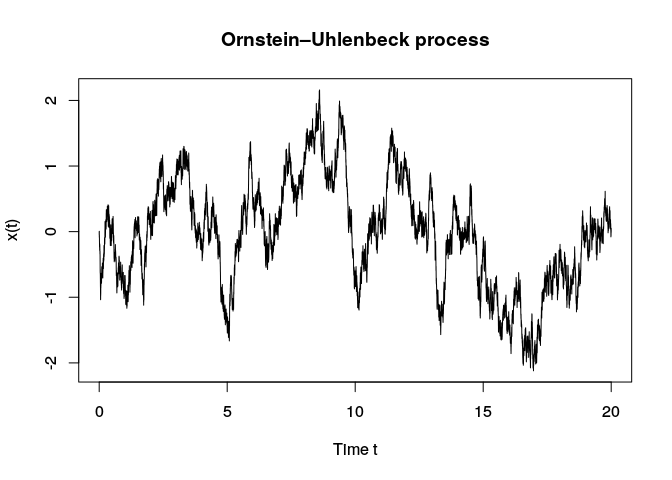
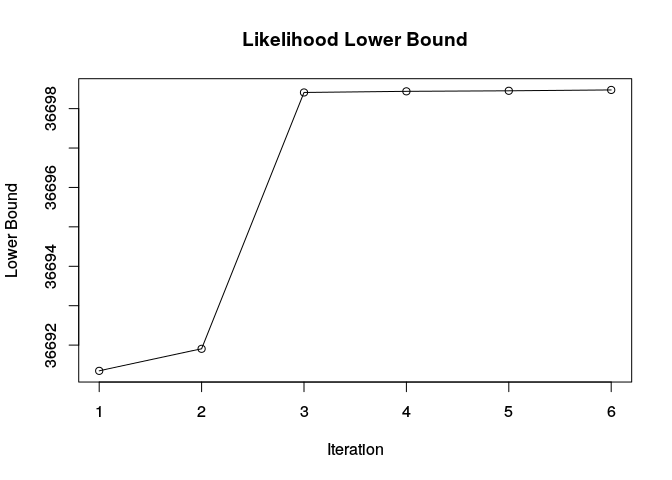
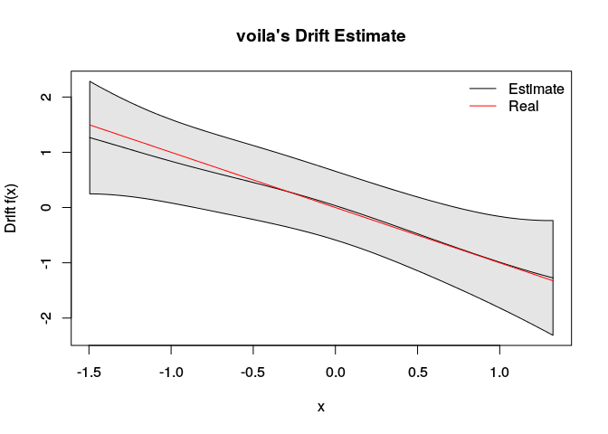
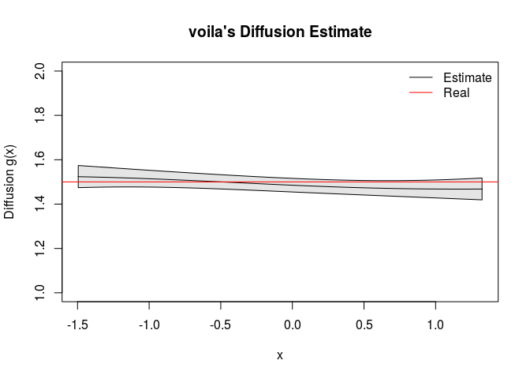

voila: Variational Inference for Langevin Equations
---------------------------------------------------

`voila` is an `R` package for the non-parametric estimation of Langevin equations (also called Stochastic Differential Equations or SDE) from a densely-observed time series. The Langevin equation states that the dynamic evolution of an observable X depends on a deterministic force, called the drift, and some random fluctuation, called the diffusion:


where W represents a [Wiener process](https://en.wikipedia.org/wiki/Wiener_process).

`voila` permits to estimate the drift and diffusion terms by modelling them as [gaussian processes](http://katbailey.github.io/post/gaussian-processes-for-dummies/) (GPs). To cope with the computational complexity that calculating the posterior distribution of the GPs requires, the GPs are approximated using a small set of function points, the inducing variables. These inducing variables are the result of evaluating the drift and diffusion terms at some *strategically* located pseudo-inputs. The pseudo-inputs and the approximate posterior distributions are learnt using [variational inference](http://blog.evjang.com/2016/08/variational-bayes.html), which minimizes the Kullback-Leibler divergence between the true posterior distribution and the approximated one.

The method is fully described in the paper:

> García, C.A., Otero, A., Félix, P., Presedo, J. & Márquez D.G. **Non-parametric Estimation of Stochastic Differential Equations with Sparse Gaussian Processes.** *Phys. Rev. E 96 (2017), 022104*. [Article](https://journals.aps.org/pre/abstract/10.1103/PhysRevE.96.022104), [Preprint](https://arxiv.org/abs/1704.04375).

Installation
------------

`voila` is not currently available on [CRAN](http://cran.r-project.org/) but it may be installed from github using [devtools](https://github.com/hadley/devtools):

``` r
library("devtools")
install_github("citiususc/voila")
```

A quick-example
---------------

In this quick-example, `voila` is used to estimate the drift and diffusion terms
from a single realization of an unidimensional [Ornstein–Uhlenbeck](https://en.wikipedia.org/wiki/Ornstein%E2%80%93Uhlenbeck_process) process.

``` r
library("voila", quietly = TRUE, verbose = FALSE)
#> 
#> Attaching package: 'zoo'
#> The following objects are masked from 'package:base':
#> 
#>     as.Date, as.Date.numeric
#> 
#> Attaching package: 'expm'
#> The following object is masked from 'package:Matrix':
#> 
#>     expm
#> ############################################
#> This is YUIMA Project package.
#> Check for the latest development version at:
#> http://R-Forge.R-Project.org/projects/yuima
#> ############################################
#> 
#> Attaching package: 'yuima'
#> The following object is masked from 'package:stats':
#> 
#>     simulate
# simulate a Ornstein-Uhlenbeck time series using voila ---------------------
set.seed(1234)
samplingPeriod = 0.001
drift = "-x"
diffusion = "sqrt(1.5)"
x = simulate_sde(drift, diffusion, samplingPeriod = 0.001, tsLength = 20000)
plot(seq(0, len = length(x), by = samplingPeriod), x, type = 'l',
     ylab = "x(t)", xlab = "Time t", main = "Ornstein–Uhlenbeck process")
```



``` r
# Variational Inference  ----------------------------------------------------
## Some parameters for the algorithm
# the number of inducing points
noInducingPoints = 10 
# Our prior belief about the amplitude of the drift and diffusion functions
functionsUncertainty = 5 
# A small value to be added to the diagonal of the covariance matrix for
# stability purposes
epsilon = 1e-5
# The dimensionality of the data
inputDim = ncol(x)
# Since the data is 1D, we shall infer the equations for the 1st
# (and unique) dimension:
targetIndex = 1

# Select some initial pseudo-inputs. The positions of the pseudo-inputs
# are optimized during the inference
pseudoInputs = matrix(seq(min(x), max(x), len = noInducingPoints), ncol = 1)

# Create the kernels defining the behaviour of the gaussian processes. 
# Create a Rational Quadratic Kernel for the drift with some initial values for
# the hyperparameters. These hyperparameters will be optimized during the 
# inference process.
driftKer = sde_kernel("rq_kernel",
                       list('amplitude' = functionsUncertainty,
                            'alpha' = 1,
                            'lengthScales' = 1.5),
                       inputDim, epsilon)
# Create an Exponential kernel + constant term for the diffusion:
# k(x,x') = (maxAmplitude - expAmplitude) + expAmplitude * exp(- (x - x') ^ 2 / (2 * lengthScale))
# Voila uses a log-normal prior to ensure the positiveness of the diffusion. The 
# 'select_diffusion_parameters' function permits to select a proper amplitude for the
#  kernel from our prior belief about the amplitude of the diffusion function. It also
# selects a mean value for the log-normal distribution (denoted with v)
diffParams = select_diffusion_parameters(x, samplingPeriod, 
                                         priorOnSd = functionsUncertainty)
diffKer =  sde_kernel("exp_const_kernel",
                      list('maxAmplitude' = diffParams$kernelAmplitude,
                           'expAmplitude' = diffParams$kernelAmplitude * 1e-3,
                           'lengthScales' = 1.5),
                      inputDim, epsilon)

# Perform the variational inference (VI)
inference = sde_vi(targetIndex, x, samplingPeriod, pseudoInputs, 
                   driftKer, diffKer, diffParams$v)
#> Starting Variational Inference
#> Initial Lower Bound L = -59222.9
#> Iteration 1| Distributions update | L = 36691.347
#> Iteration 1| Hyperparameter optimization | L = 36691.904
#> HP = 0.995 1.49 0.00219 1.5 -2.12 -1.63 -1.17 -0.682 -0.228 0.267 0.721 1.19 1.69 2.16 -0.824 
#> 
#> Iteration 2| Distributions update | L = 36698.412
#> Iteration 2| Hyperparameter optimization | L = 36698.44
#> HP = 0.997 1.51 0.00209 1.51 -2.12 -1.63 -1.17 -0.682 -0.227 0.267 0.721 1.19 1.69 2.16 -0.815 
#> 
#> Iteration 3| Distributions update | L = 36698.455
#> Iteration 3| Hyperparameter optimization | L = 36698.475
#> HP = 1 1.53 0.00205 1.52 -2.12 -1.63 -1.17 -0.682 -0.227 0.267 0.721 1.19 1.69 2.16 -0.805 
#> 
#> CONVERGENCE
# Analyze results  --------------------------------------------------------
# Check convergence
plot(inference$likelihoodLowerBound[-1], type = "o",
     main = "Likelihood Lower Bound", ylab = "Lower Bound", xlab = "Iteration")
```



``` r

# Get the estimations for the drift and diffusion
predictionSupport = matrix(seq(quantile(x,0.05), quantile(x,0.95), len = 100),
                           ncol = 1)
driftPred = predict(inference$drift, predictionSupport)
# the diffusion uses a log-normal gaussian process, so we must specify log = TRUE
diffPred = predict(inference$diff, predictionSupport, log = TRUE)

# Plot drift
realDrift = 
plot(driftPred, main = "voila's Drift Estimate",
     xlab = "x", ylab = "Drift f(x)")
lines(predictionSupport, eval(parse(text = drift), list(x = predictionSupport)),
      col = 2)
legend("topright", lty = 1, col = 1:2,
       legend = c("Estimate", "Real"), bty = "n")
```



``` r

# Plot diffusion
plot(diffPred, ylim = c(1, 2), main = "voila's Diffusion Estimate",
     xlab = "x", ylab = "Diffusion g(x)")
abline(h = eval(parse(text = diffusion), list(x = predictionSupport)) ^ 2,
       col = 2)
legend("topright", lty = 1, col = 1:2,
       legend = c("Estimate", "Real"), bty = "n")
```



vignettes
---------

A vignette is a long-form guide used for `R` packages. The `voila` vignettes can be accessed after installing the package by typing:

``` r
vignette(vignetteName, package = 'voila')
```

Currently, the following vignettes are available:

-   `'do_events'`: `voila` is applied for studying the Dansgaard-Oeschger (DO) events. The DO events are fast climate changes that occurred during the last glacial period. The vignette can be seen [here](https://citiususc.github.io/voila/do_events.html).
-   `'multivariate_analysis'`: an example of how to use `voila` to study a multi-dimensional time series. The vignette can be seen [here](https://citiususc.github.io/voila/multivariate_analysis.html).

License
-------

This project is licensed under the terms of the [GPL v3 license](LICENSE).
